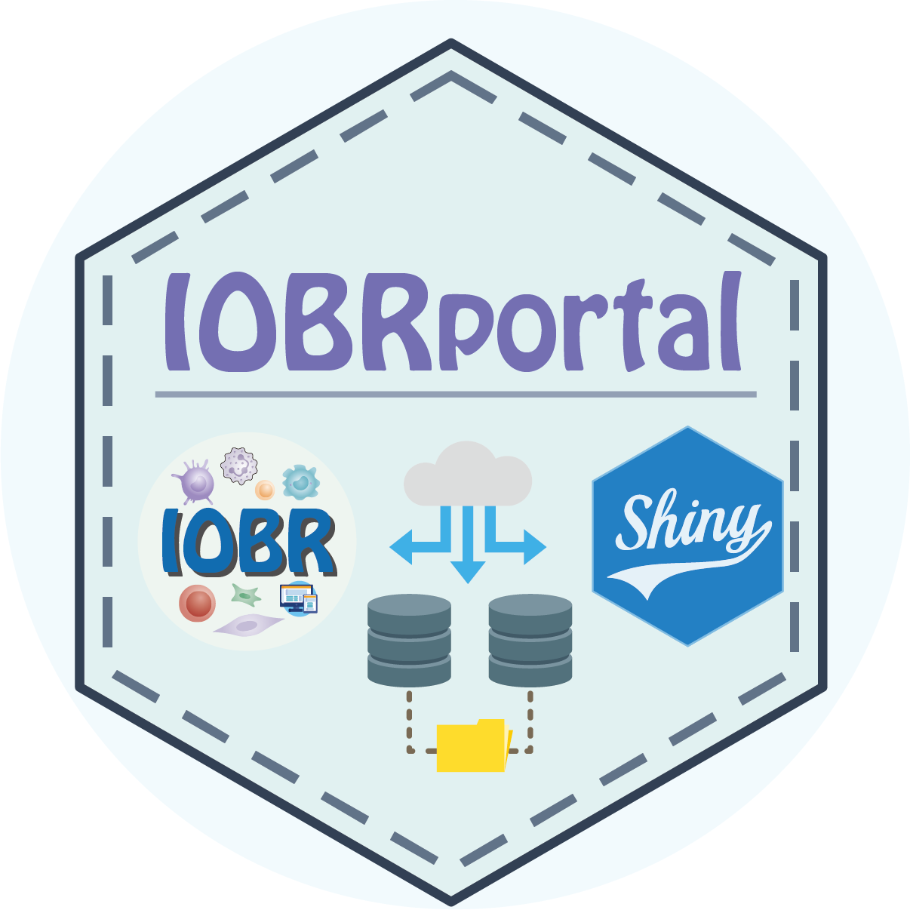
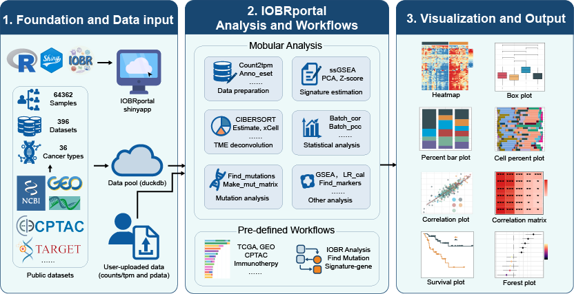

# IOBRportal

<!-- badges: start -->
<!-- badges: end -->

IOBRportal is an R package and Shiny-based web platform for bulk transcriptome and immuno-oncology studies. It integrates signature score calculation, TME deconvolution, clustering, visualization, mutation analysis, signature-gene correlation analysis and cohort-oriented workflows into a unified analysis environment. More information is available in the [IOBRportal Book](https://qingcongl.github.io/IOBRportal_book/).

<p align="center">
  
</p>

## 🧭 Overview

IOBRportal is designed to connect data preparation, feature generation, statistical analysis, and interactive visualization in one package-oriented framework. It supports both module-level analyses and workflow-level pipelines, allowing users to move from raw expression matrices or curated cohort tables to interpretable results in a reproducible manner.



## 🔄 Main workflows

### 1. Integrated Workflow

This workflow is designed for user-uploaded data and supports:

- counts to TPM conversion
- outlier detection
- signature scoring or TME deconvolution
- clustering
- phenotype combination
- downstream visualization and statistical analysis

### 2. Mutation Workflow

This workflow supports:

- mutation matrix construction from MAF files
- phenotype-associated mutation analysis
- oncoprint generation
- mutation-associated boxplot generation

### 3. Signature-Gene Workflow

This workflow supports:

- TPM preprocessing
- outlier removal
- signature calculation
- signature-gene correlation analysis
- correlation matrix construction

## 🗂️ Cohort resources

### 1. TCGA Cohorts

This workflow is designed for TCGA cohort analysis and supports:

- cohort selection
- signature or TME data preparation
- clustering
- visualization
- survival analysis
- correlation analysis
- group comparison

### 2. Cancer Cohorts

This workflow is designed for curated cancer cohort datasets and supports:

- data selection
- signature or TME preparation
- clustering
- visualization
- correlation analysis
- group comparison

### 3. Immunotherapy Cohorts

This workflow is designed for immunotherapy-focused datasets and supports:

- filtering by cancer type, treatment, drug, and timepoint
- signature or TME extraction
- clustering
- visualization
- correlation analysis
- group comparison

### 4. Other Cohorts

This workflow is designed for CPTAC/TARGET-style datasets and supports:

- cohort selection
- signature or TME data preparation
- clustering
- visualization
- survival analysis
- correlation analysis
- group comparison

## ✨ Features

### Signature score calculation

- PCA-based signature scoring
- ssGSEA-based signature scoring
- Z-score-based signature scoring
- multiple built-in signature collections

### Tumor microenvironment deconvolution

- CIBERSORT
- EPIC
- quanTIseq
- xCell
- ESTIMATE
- TIMER
- MCPcounter
- IPS
- integration mode for combined TME estimation

### Statistical analysis

- batch correlation
- partial correlation
- batch survival screening
- Wilcoxon test
- Kruskal-Wallis test

### Visualization

- heatmap
- box plot
- percent bar plot
- cell bar plot
- forest plot
- correlation plot
- correlation matrix plot
- survival plot
- survival group plot
- time-dependent ROC plot
- signature ROC plot

## 📦 Installation

You can install the development version from GitHub:

```r
# install.packages("remotes")
remotes::install_github("IOBR/IOBRportal")

```

Then load the package:

```r
library(IOBRportal)

```
For the interactive Shiny interface:

```r
run_shinyapp()

```
Some cohort-oriented modules in local deployments may require separately configured external data resources.

## 📊 Outputs

Typical outputs generated by IOBRportal include:

- processed expression matrices
- signature score matrices
- TME deconvolution tables
- cluster assignments
- combined phenotype-feature tables
- survival statistics
- correlation statistics
- group comparison results
- mutation result tables
- publication-ready figures

## 💻 Shiny application

IOBRportal is a Shiny-based interactive interface for end-to-end analysis. The application supports both user-uploaded datasets and cohort-oriented resources in a unified workflow environment. In deployed full-data instances, database-backed cohort modules can be used for interactive analysis alongside upload-based workflows.

## 📝 Citation

If you use IOBRportal in your work, please cite:

- the IOBRportal package paper or preprint, when available
- the original methods implemented in the package, such as CIBERSORT, EPIC, xCell, ESTIMATE, TIMER, MCPcounter, quanTIseq, IPS, and related statistical tools

## ✉️ Contact

E-mail questions or bug reports to:
- **Qingcong Luo** (qingcongl@163.com)
- **Dr. Dongqiang Zeng** (interlaken@smu.edu.cn)

## 📄 License

IOBRportal is released under the GNU General Public License v3.0 (GPL-3).